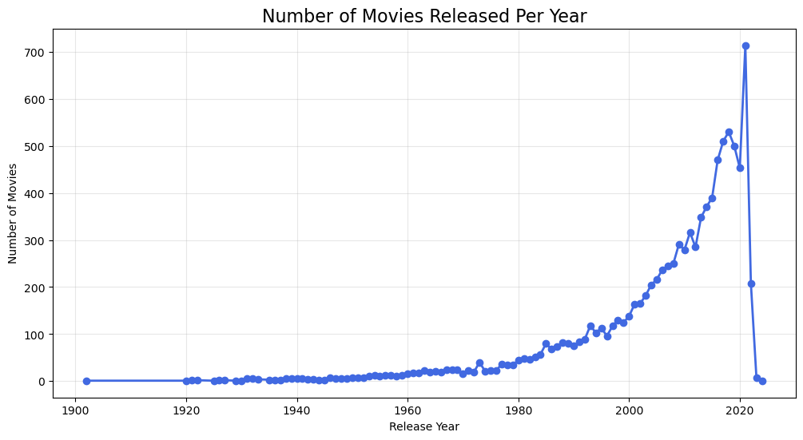
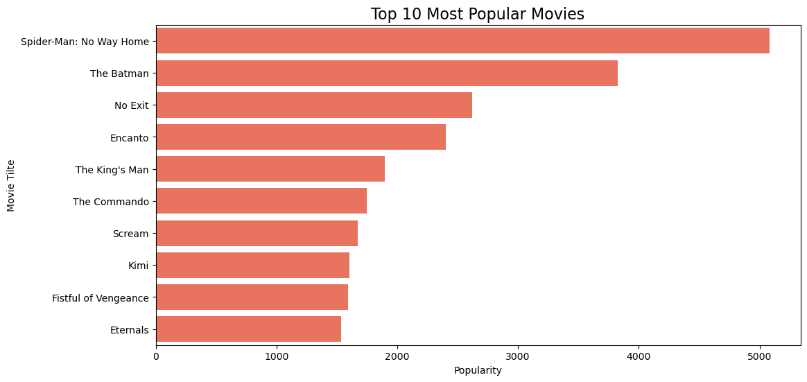
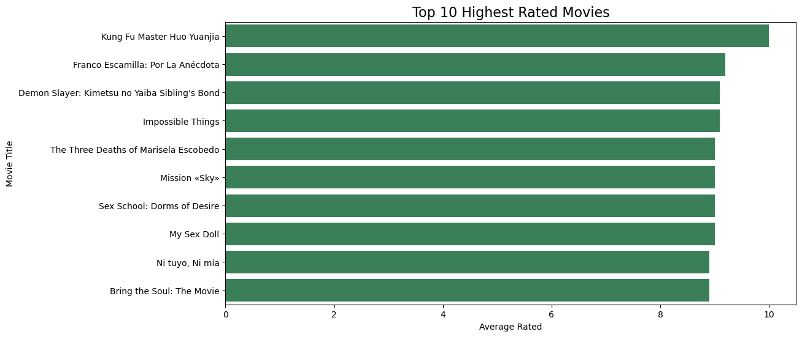
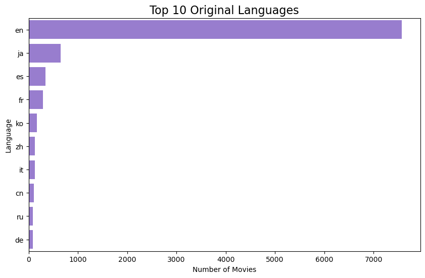
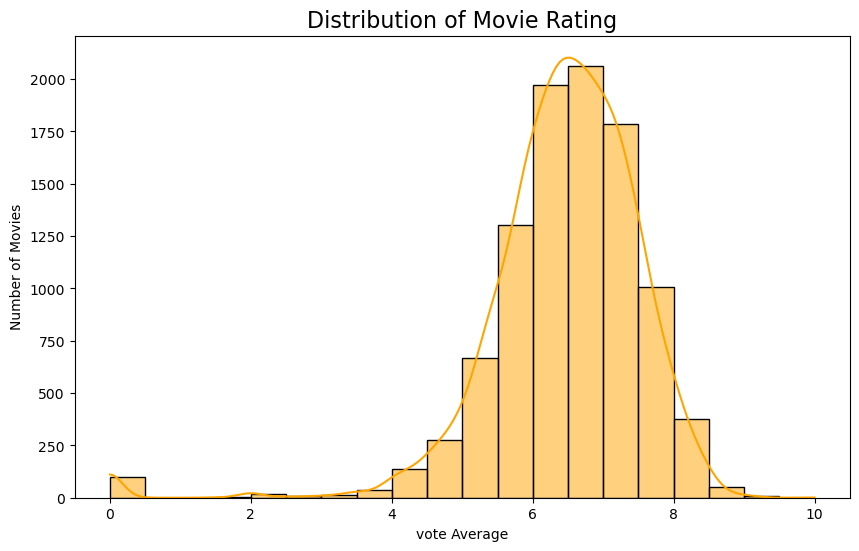
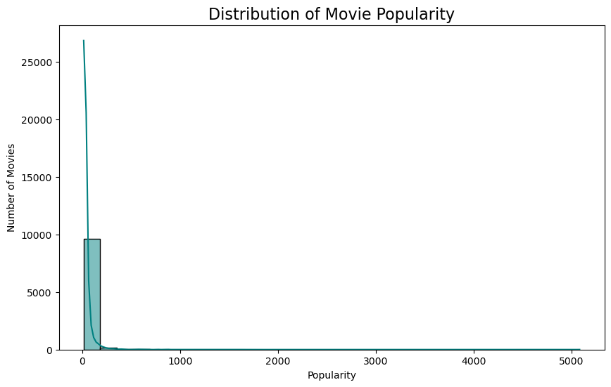
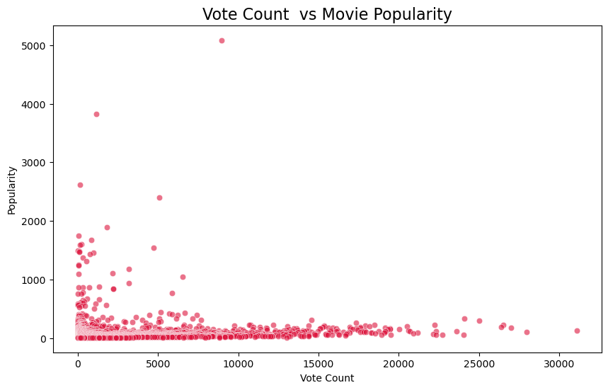
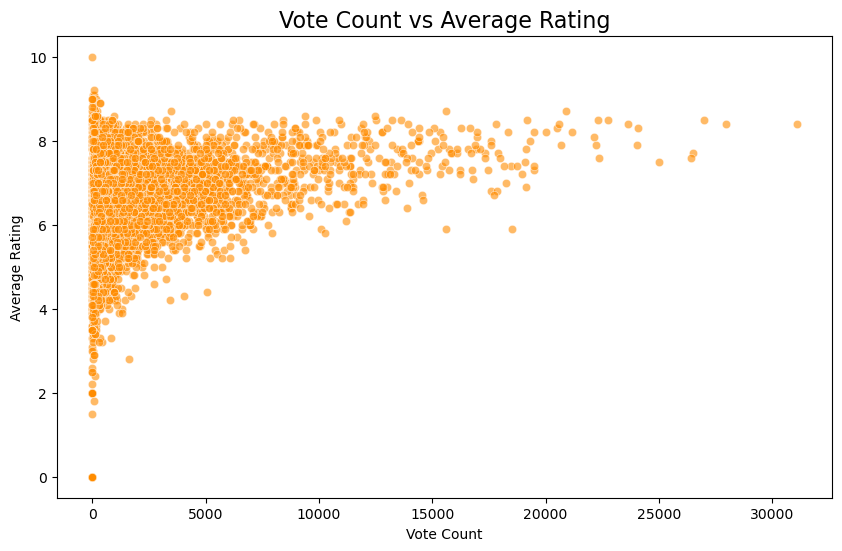

# 🎬 Netflix Data Analysis

## 📌 Project Overview

This project analyzes Netflix movie data using Python to explore movie ratings, popularity, genres, languages, and release trends.

The project focuses on Exploratory Data Analysis (EDA) and data visualization to identify patterns and insights within the dataset.

## 🎯 Objectives

- Analyze Netflix movie ratings and popularity
- Explore movie genres and languages
- Study release-year trends
- Identify patterns in movie data
- Perform exploratory data analysis
- Create meaningful visualizations

## 🛠️ Technologies Used

- Python
- Pandas
- NumPy
- Matplotlib
- Seaborn
- Jupyter Notebook

## 🔍 Project Workflow

1. Data Loading
2. Data Understanding
3. Data Cleaning
4. Exploratory Data Analysis
5. Genre Analysis
6. Rating Analysis
7. Popularity Analysis
8. Language Analysis
9. Release Trend Analysis
10. Data Visualization

## 📊 Analysis Performed

### 🎭 Genre Analysis
Analyzed the distribution and presence of different movie genres.

### ⭐ Rating Analysis
Explored movie ratings and their distribution across the dataset.

### 🔥 Popularity Analysis
Examined popularity patterns among movies.

### 🌍 Language Analysis
Analyzed the languages represented in the movie dataset.

### 📅 Release Trend Analysis
Explored how movie releases are distributed across different years.

## 📈 Data Visualization

The project uses Matplotlib and Seaborn to create visualizations that make patterns and trends easier to understand.

## 💡 Key Skills Demonstrated

- Data Cleaning
- Exploratory Data Analysis
- Data Visualization
- Python Programming
- Pandas
- NumPy
- Matplotlib
- Seaborn
- Business & Data Insights

  ## 📊 Project Visualizations

### Movie Ratings Distribution

### Movie Popularity Analysis

### Genre Analysis

### Language Distribution

### Release Year Trends

### Movie Analysis

### Genre Distribution

### Rating Analysis

👩‍💻 Author

Shabeena Bano

GitHub: https://github.com/shabeenabano

LinkedIn: https://www.linkedin.com/in/shabeena-bano-49861542b/
